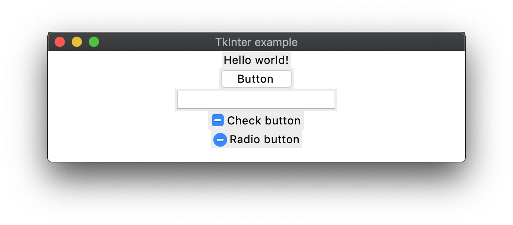
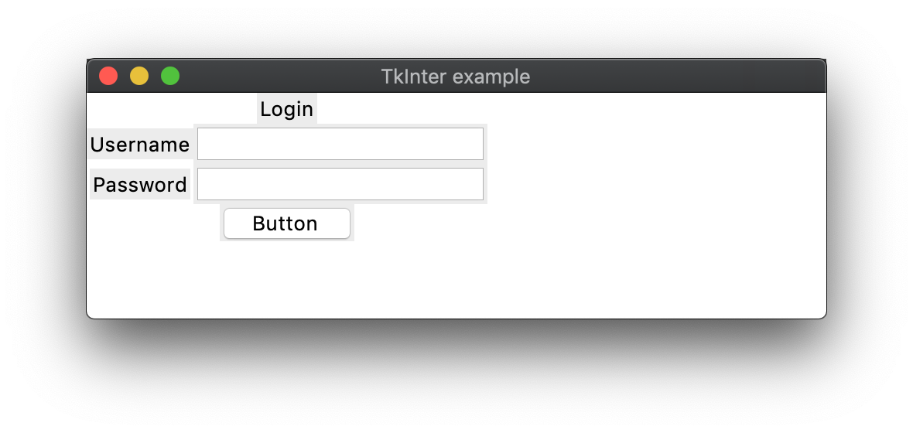
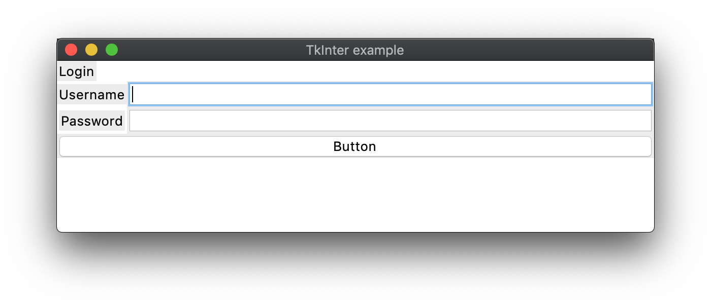

# TkInter ja graafisen käyttöliittymän toteutus

Python-sovellusten graafisten käyttöliittymien toteutuksessa on jo standardiksi muodostonut [TkInter](https://wiki.python.org/moin/TkInter)-kirjaston käyttö. TkInter on Pythonin omia moduuleja, joten sitä ei tarvitse erikseen asentaa. Tutustutaan tässä osiossa, miten sen avulla voi toteuttaa graafisia käyttöliittymiä.

## Ikkunan avaaminen

Graafista käyttöliittymää käytetään usein tietokoneen näytölle aukeavan ikkunan kautta. Ikkunan alustaminen onnistuu `Tk`-luokan avulla:

```python
from tkinter import Tk

window = Tk()
window.title("TkInter example")
window.mainloop()
```

Kun koodi suoritetaan, pitäisi aueta ikkuna, jonka otsakkeena on,`title`-metodin kautta asetettu, "TkInter-esimerkki". `mainloop`-metodin kutsu käynnistää loputtoman silmukan, jonka aikana TkInter odottaa käyttöliittymään kohdistuvia tapahtumia, kuten painikkeiden painalluksia. Huomaa, että `mainloop`-metodin kutsun jälkeistä koodia ei enää suoriteta:

```python
# ...
window.mainloop()
print("Hello world!")
```

Tulostusta ei tulosteta, koska koodin suoritus on siirtynyt ikuiseen silmukkaan.

## Graafiset komponentit

TkInter tarjoaa käyttöömme monia graafisia komponentteja, kuten tekstiä, nappeja ja tekstikenttiä. Tekstin lisääminen onnistuu `Label`-komponentin avulla:

```python
from tkinter import Tk, ttk

class UI:
  def __init__(self, root):
    self.root = root

  def initialize(self):
    label = ttk.Label(master = self.root, text = "Hello world!")

    label.pack()

window = Tk()
window.title("TkInter example")

ui = UI(window)
ui.initialize()

window.mainloop()
```

Koodi sai hieman paremman rakenteen. `UI`-luokka saa konstruktorin kautta juurikomponentin, johon se liittää lisäämänsä komponentit. Metodissa `initialize` alustaa `Label`-olion ja kerromme sille parametrin `master` kautta, että se liitetään juurikomponenttiin, `root`. `text`-parametri sen sijaan määrittelee itse näytettävän tekstin.

Huomaa, ettei komponettia näytetä ennen `pack`-metodin kutsua. Tutustumme metodin merkitykseen pian. Lisätään sitä ennen vielä lisää komponentteja käyttöliittymäämme.

```python
def initialize(self):
    label = ttk.Label(master = self.root, text = "Hello world!")
    button = ttk.Button(master = self.root, text = "Button")
    entry = ttk.Entry(master = self.root)
    checkbutton = ttk.Checkbutton(master = self.root, text = "Check button")
    radiobutton = ttk.Radiobutton(master = self.root, text = "Radio button")

    label.pack()
    button.pack()
    entry.pack()
    checkbutton.pack()
    radiobutton.pack()
```

Nyt käyttöliittymämme näyttää seuraavalta:



## Komponenttien asettelu

Edellisestä esimerkissä huomasimme, että `pack`-metodin kutsu asettaa komponentit allekkain. Kutsujen järjestyksellä on väliä, koska metodi etsii suorituksen hetkellä ensimmäisen "tyhjän" paikan komponentille. Voimme vaikuttaa mihin suuntaan komponentit asetellaan käyttämällä `side`-parametria:

```python
from tkinter import Tk, ttk, constants


class UI:
    def __init__(self, root):
        self.root = root

    def initialize(self):
        label = ttk.Label(master=self.root, text="Hello world!")
        button = ttk.Button(master=self.root, text="Button")
        entry = ttk.Entry(master=self.root)
        checkbutton = ttk.Checkbutton(master=self.root, text="Check button")
        radiobutton = ttk.Radiobutton(master=self.root, text="Radio button")

        label.pack(side=constants.LEFT)
        button.pack(side=constants.LEFT)
        entry.pack()
        checkbutton.pack()
        radiobutton.pack()

# ...
```

Komponenttien asettelussa `pack`-metodin käyttöä käytännöllisempää on käyttää `grid`-metodia. Gridissä on rivejä ja sarakkeita, joihin voimme sijottaa komponentteja:

```python
def initialize(self):
    heading_label = ttk.Label(master=self.root, text="Login")

    username_label = ttk.Label(master=self.root, text="Username")
    username_entry = ttk.Entry(master=self.root)

    password_label = ttk.Label(master=self.root, text="Password")
    password_entry = ttk.Entry(master=self.root)

    button = ttk.Button(master=self.root, text="Button")

    heading_label.grid(row=0, column=0, columnspan=2)

    username_label.grid(row=1, column=0)
    username_entry.grid(row=1, column=1)

    password_label.grid(row=2, column=0)
    password_entry.grid(row=2, column=1)

    button.grid(row=3, column=0, columnspan=2)
```

Käyttöliittymällämme on käytössä kolmen rivin ja kahden sarakkeen gridi. Lopputulos on näyttää seuraavalta:



`heading_label` on ensimmäisellä rivillä ja ensimmäisellä sarakkeella. Tämä tulee ilmi `grid`-metodin `row`- ja `column`-parametreista. Lisäksi `heading_label` levittäytyy kahdelle sarakkeelle, eli vie leveyssuunnassa kaiken tilan. Tämä käy ilmi `columspan`-parametrista.

`username_label` on toisella rivillä ja ensimmäisellä sarakkeella. Tämän viereen tulee `username_entry`, joka on samalla rivillä, mutta toisella sarakkeella. `password_label` ja `password_entry` asettuvat samankaltaisesti, mutta vain eri riville.

Lopuksi `button` asettuu gridin viimeiselle, kolmannelle riville. Samoin kuten `heading_label`, myös `button` levittäytyy kahdelle sarakkeelle.

Olemme käyttöliittymään melko tyytyväisiä, mutta pari pientä yksityiskohtaa pitäisi vielä korjata. Kun kasvatamme ikkunan kokoa, huomaamme, ettei komponenttien koko muutu tämän seurauksena. Haluaisimme, että tekstikentät ja kirjautumis-painike ottaisi kaiken jäljellä jäävän tilan leveyssuunnassa. Tämä onnistuu konfiguroimalla juurikomponentin gridin sarakkeita:

```python
def initialize(self):
    heading_label = ttk.Label(master=self.root, text="Login")

    username_label = ttk.Label(master=self.root, text="Username")
    username_entry = ttk.Entry(master=self.root)

    password_label = ttk.Label(master=self.root, text="Password")
    password_entry = ttk.Entry(master=self.root)

    button = ttk.Button(master=self.root, text="Button")

    heading_label.grid(row=0, column=0, columnspan=2)

    username_label.grid(row=1, column=0)
    username_entry.grid(row=1, column=1)

    password_label.grid(row=2, column=0)
    password_entry.grid(row=2, column=1)

    button.grid(row=3, column=0, columnspan=2)

    # konfiguroidaan toisen sarakkeen painoksi 1
    self.root.grid_columnconfigure(1, weight=1)
```

`grid_columnconfigure`-metodia tulee kutsua `master`-parametrin kautta annetulle juurikomponentille. Konfiguroimme toisen sarakkeen (huomaa, että indeksi alkaa nollasta) painoksi 1. Tämä tarkoittaa, että sarake ottaa kaiken vapaana olevan tilan leveyssuunnassa.

Käyttöliittymä ei tämänkään muutokseen jälkeen näytä siltä, miltä pitäisi. Tämä johtuu siitä, että meidän täytyy vielä kertoa `username_entry`-, `password_entry`- ja `button`-komponenteille, mihin suuntiin ne sijoittuvat. Tämä onnistuu `sticky`-parametrin avulla:

```python
def initialize(self):
    heading_label = ttk.Label(master=self.root, text="Login")

    username_label = ttk.Label(master=self.root, text="Username")
    username_entry = ttk.Entry(master=self.root)

    password_label = ttk.Label(master=self.root, text="Password")
    password_entry = ttk.Entry(master=self.root)

    button = ttk.Button(master=self.root, text="Button")

    # vasempaan laitaan
    heading_label.grid(row=0, column=0, columnspan=2, sticky = constants.W)

    username_label.grid(row=1, column=0)
    # vasempaan ja oikeaan laitaan
    username_entry.grid(row=1, column=1, sticky=(constants.E, constants.W))

    password_label.grid(row=2, column= 0)
    # vasempaan ja oikeaan laitaan
    password_entry.grid(row=2, column= 1, sticky=(constants.E, constants.W))

    # vasempaan ja oikeaan laitaan
    button.grid(row=3, column=0, columnspan=2, sticky=(constants.E, constants.W))

    self.root.grid_columnconfigure(1, weight=1)
```

Nyt käyttöliittymä näyttää seuraavalta:



Kaikki kolme komponenttia sijoittuvat siis, sekä itä- (E), että länsi-suunnassa (W). `sticky`-parametrin `constants.EW` arvo saa siis komponentien sijoittumaan sekä vasemmalle, että oikealle. `header_label`-komponentin `sticky`-parametrin arvo `constants.W` saa sen sijoittumaan vasemmalle.

`sticky`-parametrille mahdollisia arvoja ovat `constants.W` (vasen), `constants.E` (oikea), `constants.N` (ylä), `constants.S` (ala) ja näiden kombinaatit [tuplena](https://docs.python.org/3.3/library/stdtypes.html?highlight=tuple#tuple). Arvoista voi käyttää myös suoraan merkkijonoesitystä, kuten `"w"` vakion `constants.W` sijaan. Vakioiden käyttö on kuiten suotavaa.

## Tapahtumien kuuntelu

TkInter mahdollistaa erilaisten tapahtumien, kuten napin painamisen, "kuuntelemisen". Kuuntelemisella tässä yhteydessä tarkoitetaan, että voimme määrittää funktion, jota kutsutaan, kun esimerkiksi painiketta painetaan. Käytetään esimerkkinä seuraavaa koodia, jossa määritellään yksi tekstikenttä ja yksi painike:

```python
from tkinter import Tk, ttk

class UI:
  def __init__(self, root):
    self.root = root
    self.entry = None

  def initialize(self):
    self.entry = ttk.Entry(master=self.root)
    button = ttk.Button(master=self.root, text="Button")
    
    entry.grid(row=0, column=0)
    button.grid(row=1, column=0)

window = Tk()
window.title("TkInter example")

ui = UI(window)
ui.initialize()

window.mainloop()
```

Lisätään koodiin toiminallisuus, joka tulostaa tekstikentän arvon, kun painiketta painetaan:

```python
class UI:
  def __init__(self, root):
    self.root = root
    self.entry = None

    def handle_button_click(self):
        entry_value = self.entry.get()
        print(f"Value of entry is: {entry_value}")

    def initialize(self):
        self.entry = ttk.Entry(master=self.root)

        button = ttk.Button(
          master=self.root,
          text="Button",
          command=self.handle_button_click
        )
        
        entry.grid(row=0, column=0)
        button.grid(row=1, column=0)

# ...
```

`UI`-luokan metodi `handle_button_click` lukee tekstikentän arvon `get`-metodilla ja tulostaa sen. Metodin kutsuminen napin painalluksen yhteydessä tapahtuu `initialize`-metodissa, jossa `button`-komponentille on määritelty `command`-parametri. Parametrin arvo tulee olla kutsuttavissa, joten se voi olla esimerkiksi metodi, funktio, tai [lambda](https://docs.python.org/3/tutorial/controlflow.html#lambda-expressions). Lambdan käyttö olisi erityisen hyödyllistä esimerkiksi, jos haluaisimme antaa `handle_button_click`-metodille argumentin:

```python
button_a = ttk.Button(
  master=self.root,
  text="Button A",
  command=lambda: self.handle_button_click('button a')
)

button_a = ttk.Button(
  master=self.root,
  text="Button B",
  command=lambda: self.handle_button_click('button b')
)
```

Esimerkissä napin painallus kutsuu lambdaa, joka puolestaa kutsuu metodia tietyllä argumentilla.

## Monta näkymää

Sovelluksissa on usein tarve useammalle näkymälle. Näkymät voidaan toteuttaa esimerkiksi luokkina, jotka saavat konstruktorin kautta juurikomponenttinsa:

```python
from tkinter import ttk, constants

class HelloView:
  def __init__(self, root, handle_good_bye):
    self.root = root
    self.handle_good_bye = handle_good_bye
    self.frame = None

    self.initialize()

  def initialize(self):
    self.frame = ttk.Frame(master=self.root)
    label = ttk.Label(master=self.frame, text="Hello!")
    button = ttk.Button(master=self.frame, text="Say good bye", command=self.handle_good_bye)
    
    label.grid(row=0, column=0)
    button.grid(row=1, column=0)

  def pack(self):
      self.frame.pack(fill=constants.X)

  def destroy(self):
      self.frame.destroy()
```

Luokan `initialize`-metodissa määritellään meille ennestään tuntematon, `Frame`-komponentti. `Frame`-komponentilla ei ole visuaalisesti mitään erityispiirteitä, mutta sitä on erittäin kätevä käyttää komponenttien ryhmittelyyn. Haluamme eristää näkymän komponentit muiden näkymien komponenteista, joten liitämme ne `master`-parametrin kautta `frame`-komponenttiin. Tämä mahdollistaa sen, että voimme näyttää kaikki näkymän komponentit kerralla lukan `pack`-metodin avulla. Lisäksi voimme tuhota kaikki näkymän komponentit luokan `destroy`-metodilla. Kun komponentti tuhotaan, myös sen lapsikomponentit, eli `master`-parametrin avulla liitetyt komponentit tuhotaan.

Muokataan `UI`-luokkaa niin, että `HelloView`-näkymä näytetään, kun käyttöliittymä käynnistyy:

```python
from tkinter import Tk
from hello_view import HelloView

class UI:
    def __init__(self, root):
        self.root = root
        self.current_view = None

    def handle_good_bye(self):
        print("User wants to say good bye")

    def show_hello_view(self):
        self.current_view = HelloView(
            self.root,
            self.handle_good_bye
        )

        self.current_view.pack()

    def initialize(self):
        self.show_hello_view()


window = Tk()
window.title("TkInter example")

ui = UI(window)
ui.initialize()

window.mainloop()
```

Käyttöliittymän "Say good bye"-painikkeen painaminen pitäisi tulostaa `handle_good_bye`-metodissa määritellemämme viesti. Toteutetaan vielä toinen `HelloView`-näkymää vastaava näkymä, `GoodByeView`:

```python
from tkinter import ttk, constants

class GoodByeView:
  def __init__(self, root, handle_hello):
    self.root = root
    self.handle_hello = handle_hello
    self.frame = None

    self.initialize()

  def initialize(self):
    self.frame = ttk.Frame(master=self.root)
    label = ttk.Label(master=self.frame, text="Good bye!")
    button = ttk.Button(master=self.frame, text="Say hello", command=self.handle_hello)
    
    label.grid(row=0, column=0)
    button.grid(row=1, column=0)

  def pack(self):
      self.frame.pack(fill=constants.X)

  def destroy(self):
      self.frame.destroy()
```

Muokataan `UI`-luokkaa niin, että käyttäjä voi siirtyä näiden kahden näkymän välillä:

```python
from tkinter import Tk
from hello_view import HelloView
from good_bye_view import GoodByeView

class UI:
    def __init__(self, root):
        self.root = root
        self.current_view = None

    def hide_current_view(self):
        if self.current_view:
            self.current_view.destroy()

        self.current_view = None

    def handle_good_bye(self):
        self.show_good_bye_view()

    def handle_hello(self):
        self.show_hello_view()

    def show_hello_view(self):
        self.hide_current_view()

        self.current_view = HelloView(
            self.root,
            self.handle_good_bye
        )

        self.current_view.pack()

    def show_good_bye_view(self):
        self.hide_current_view()

        self.current_view = GoodByeView(
            self.root,
            self.handle_hello
        )

        self.current_view.pack()

    def initialize(self):
        self.show_hello_view()

# ...
```

Nyt luokasta löytyy metodi `hide_current_view`, joka piilottaa nykyisen näkymän kutsumalla sen `destroy`-metodia. Metodit `show_hello_view` ja `show_good_bye_view` ensin piilottavat nykyisen näkymän ja sen jälkeen näyttävät uuden näkymän. `handle_hello`- ja `handle_good_bye`-metodit yksinkertaisesti kutsuvat näytettävän näkymän näyttävää metodia.

Käyttäjän pitäisi nyt pystyä siirtymään näkymien välillä painamalla "Say hello"- ja "Say good bye"-painikkeita.

## Muuttujat
